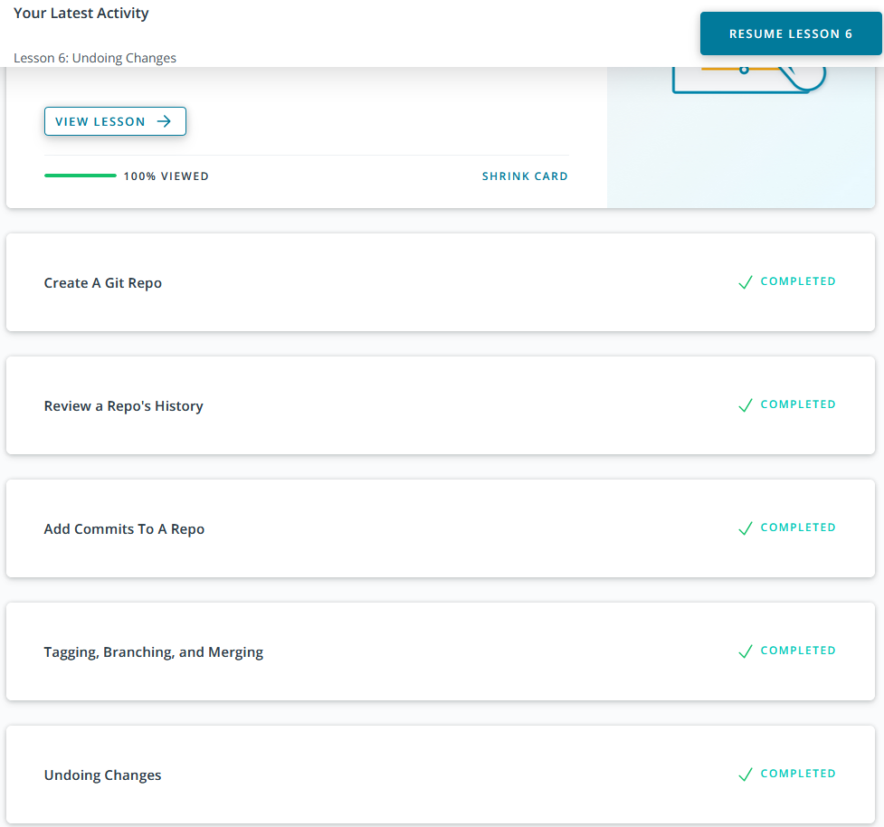
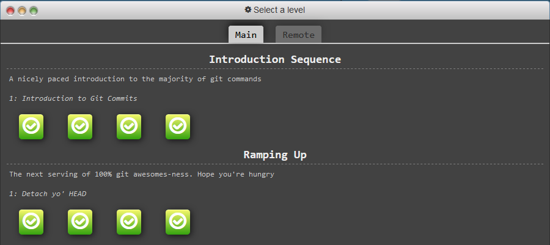
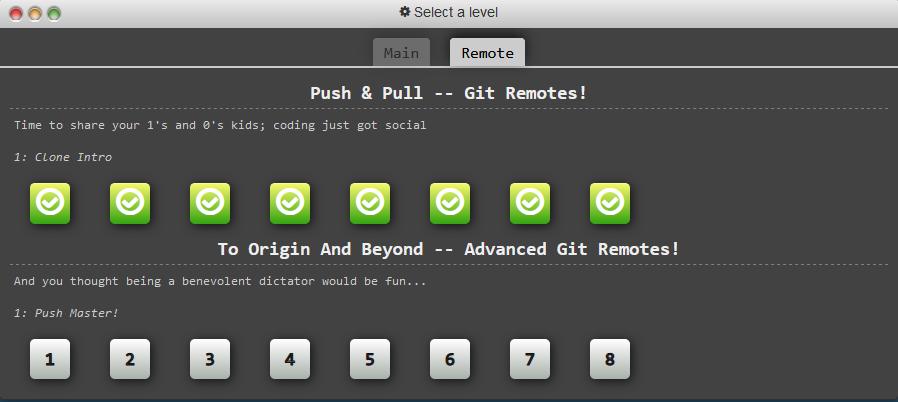

# Front-End Course by Kottans

## Stage 0. Self-Study

0. [Git Basics](#git_basics) :heavy_check_mark:

## <a name="git_basics">Git Basics</a>

My name is Volodymyr. And I've always wanted to be part of the programming community.

I heard and read so much about GIT in podcasts, articles, etc. And thank for your course and organized links about it — i'm finally take an opportunity to learn and practice with GIT by my self.

_That is my progress of learning stuff in screenshots:_
### from [Udacity](https://www.udacity.com/course/version-control-with-git--ud123)

### from [Learn Git Branching](https://learngitbranching.js.org/)

